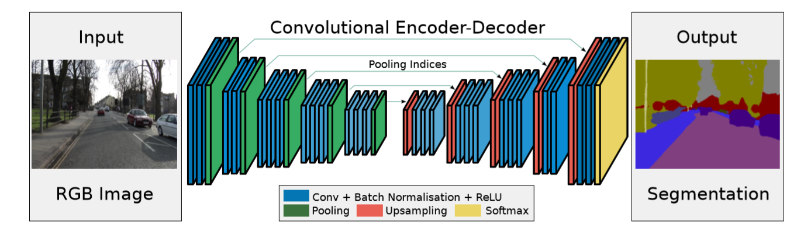
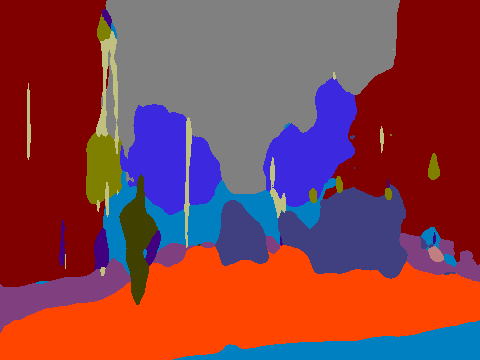
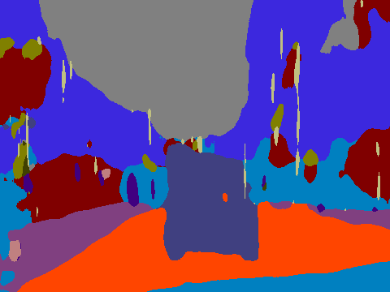

# Tensorflow-SegNet
This code is heavily folllowed  https://github.com/search?q=Tensorflow-SegNet

# Requirement
tensorflow 1.0
Pillow (optional, for write label image)
scikit-image

#Model
Our architecture is from SegNet: A Deep Convolutional Encoder-Decoder Architecture for Image Segmentation Vijay Badrinarayanan, Alex Kendall and Roberto Cipolla, PAMI 2017 [http://arxiv.org/abs/1511.00561]. And here is the model:

We have trained this model using the data from author's github https://github.com/alexgkendall/SegNet-Tutorial in the CamVid folder. This dataset is public and we get the not bad performance. Here we list serveral original pictures and its semantic segmentation:

<figure>
    
</figure>
<figure>
    
</figure>

# Usage
see also example.sh
training:

  python main.py --log_dir=path_to_your_log --image_dir=path_to_CamVid_train.txt --val_dir=path_to_CamVid_val.txt --batch_size=5

finetune:

  python main.py --finetune=path_to_saved_ckpt --log_dir=path_to_your_log --image_dir=path_to_CamVid_train.txt --val_dir=path_to_CamVid_val.txt --batch_size=5

testing:

  python main.py --testing=path_to_saved_ckpt --log_dir=path_to_your_log --test_dir=path_to_CamVid_train.txt --batch_size=5 --save_image=True

You can set default path and parameters in main.py line 6~18.
note: in --testing you can specify whether to save predicted images, currently only save one image
for manually checking, will be configured to be more flexible.

# Dataset
The images for testing in IBM, label.png means the label for disaster.png. Ohter image pair is obviously to watch.
The outcome is in test_seg, you could find the original image and its segmentation map

.......
